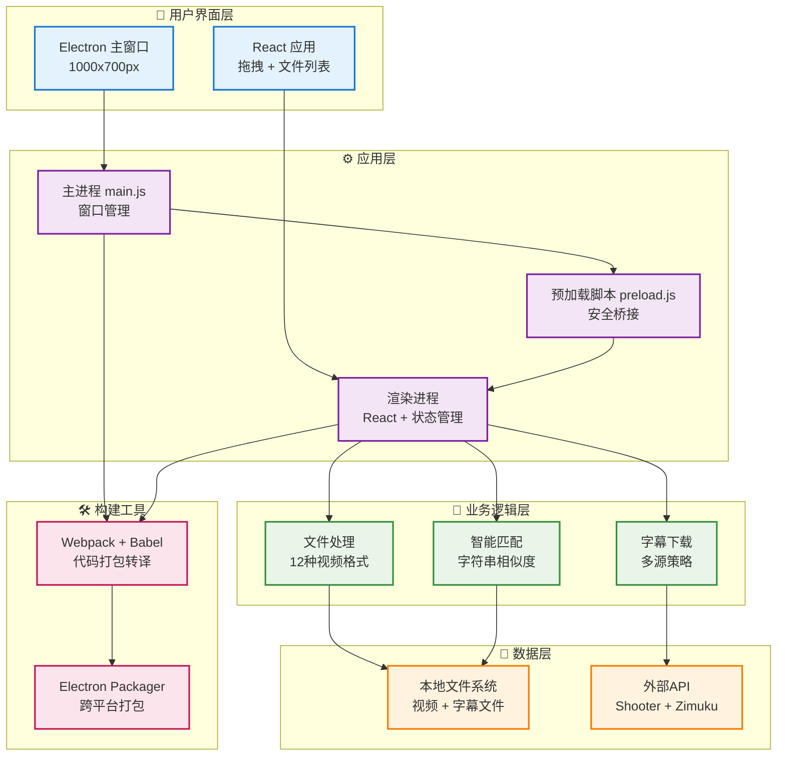

# Subtitles Downloader

A desktop application based on Electron for automatically downloading movie subtitles.

## Features

- 🎬 **Multiple Video Formats Support**: avi, mp4, mkv, rmvb, rm, asf, divx, mpg, mpeg, mpe, wmv, vob
- 📁 **Drag & Drop**: Support dragging single video files or folders containing videos
- 🔍 **Smart Matching**: Uses string similarity algorithm to automatically match the most suitable subtitles
- 📥 **Multiple Sources**: Downloads from Shooter and Zimuku.net subtitle sources
- ⚡ **Batch Processing**: Supports batch downloading subtitles for multiple videos
- 🎯 **Auto Save**: Subtitle files are automatically saved to the same directory as video files
- ✅ **Smart Selection**: Support individual selection and select all/deselect all functionality
- 📊 **Status Display**: Real-time file status and download progress indicators
- 🎨 **Modern Interface**: Beautiful user interface with status icons and color coding

## Installation

### Requirements
- Node.js (recommended v12 or higher)
- npm or yarn

### Installation Steps

1. Clone the project to local
```bash
git clone <repository-url>
cd Subtitles-Downloader
```

2. Install dependencies
```bash
npm install
```

3. Build and run the application
```bash
npm start
```

### Build for Distribution

```bash
npm run build
```

The built application will be generated in the `builds` directory.

## Usage

1. **Start the application**: Run `npm start` to launch the subtitle downloader
2. **Add video files**:
   - Drag video files to the application window
   - Or drag folders containing video files to the application window
3. **Select files**:
   - Click on filenames in the list to select videos for subtitle downloading
   - Use "Select All" button to quickly select all files
   - Use "Deselect All" button to unselect all files
4. **Download subtitles**: Click the "Download Selected Files" button to start downloading
5. **Check status**:
   - ⏳ Pending: File selected, waiting to start download
   - ✅ Downloaded: Subtitle successfully downloaded
   - ❌ Fail: Download failed, will try backup source
6. **File management**: Use "Remove Selected" button to delete unwanted files

## Subtitle Sources

### Shooter
- Primary subtitle source
- Uses `shooter` library for subtitle search and download
- Supports precise subtitle matching through video file hash values

### Zimuku.net
- Backup subtitle source
- Automatically switches when Shooter cannot find matching subtitles
- Uses web scraping technology to search and download subtitles

## Technical Architecture

### System Architecture Diagram



### 核心组件说明

| 层级 | 组件 | 功能描述 |
|------|------|----------|
| 🎨 **UI层** | Electron主窗口 | 桌面应用窗口，支持拖拽操作 |
| | React应用 | 用户界面，文件列表和状态显示 |
| ⚙️ **应用层** | 主进程 | 窗口生命周期、菜单管理、安全配置 |
| | 预加载脚本 | 安全的上下文桥接，IPC通信 |
| | 渲染进程 | React应用主体，状态和事件处理 |
| 🔧 **业务层** | 文件处理 | 视频格式验证，文件系统操作 |
| | 字幕下载 | 多源下载策略（Shooter + Zimuku + 本地） |
| | 智能匹配 | 字符串相似度算法，文件名解析 |
| 💾 **数据层** | 本地文件系统 | 视频文件和字幕文件存储 |
| | 外部API | Shooter字幕服务，Zimuku网站数据 |
| 🛠️ **构建层** | Webpack + Babel | 代码打包和ES6+转译 |
| | Electron Packager | 跨平台应用打包 |

### Architecture Overview

The application follows a layered architecture pattern with clear separation of concerns:

#### 1. **用户界面层 (UI Layer)**
- **主窗口**: 1000x700像素的Electron窗口
- **拖拽区域**: 支持拖拽视频文件或文件夹
- **文件列表**: 显示视频文件状态和选择状态
- **操作按钮**: 下载、移除、全选等操作
- **状态显示**: 实时显示下载进度和状态
- **关于窗口**: 应用信息展示

#### 2. **应用层 (Application Layer)**
- **主进程 (main.js)**: 
  - 窗口生命周期管理
  - 菜单栏配置
  - 安全设置和SSL配置
- **预加载脚本 (preload.js)**: 
  - 安全的上下文桥接
  - IPC通信接口
- **渲染进程**: 
  - React应用主体
  - 文件状态管理
  - 用户交互处理

#### 3. **业务逻辑层 (Business Logic Layer)**
- **文件处理**:
  - 支持12种视频格式验证
  - 递归文件夹扫描
  - 文件系统操作
- **字幕下载**:
  - **Shooter API**: 主要字幕源，基于文件哈希匹配
  - **Zimuku.net**: 备用字幕源，使用网页爬虫
  - **本地搜索**: 查找已存在的字幕文件
- **智能匹配**:
  - 字符串相似度算法
  - 文件名智能解析

#### 4. **数据层 (Data Layer)**
- **本地文件系统**: 视频文件和字幕文件存储
- **外部API**: 
  - Shooter字幕服务
  - Zimuku网站数据

#### 5. **构建工具 (Build Tools)**
- **Webpack**: 模块打包和代码转译
- **Babel**: ES6+代码转译
- **Electron Packager**: 跨平台应用打包

### Frontend Technologies
- **Electron**: Cross-platform desktop application framework
- **React**: User interface library
- **Bootstrap 3**: UI styling framework
- **Webpack**: Module bundler

### Core Dependencies
- `cheerio`: Server-side jQuery implementation for web parsing
- `axios`: HTTP request library
- `string-similarity`: String similarity comparison algorithm
- `shooter`: Subtitle download library

## Development

### Project Structure
```
Subtitles-Downloader/
├── main.js              # Electron main process
├── view.js              # React frontend components
├── index.html           # Main page
├── about.html           # About page
├── webpack.config.js    # Webpack configuration
├── package.json         # Project configuration
└── assets/              # Resource files
    └── images/          # Icon files
```

### Development Commands
```bash
# Run in development mode
npm start

# Build frontend code only
npm run webpack

# Package application
npm run package

# Build and package
npm run build
```

## Notes

1. **Network Connection**: The application requires internet connection to access subtitle sources
2. **File Permissions**: Ensure the application has permission to access video file directories
3. **Subtitle Quality**: Subtitle quality depends on the source, recommend checking subtitle content after download
4. **Copyright Notice**: Please comply with relevant copyright laws and regulations, only download legally authorized subtitles
5. **Security Warning**: Security warnings in development environment are normal and won't appear in packaged apps
6. **Module Loading**: First startup will show "Loading modules..." - please wait patiently

## FAQ

### Q: Why can't I find subtitles for some videos?
A: Possible reasons include:
- Video filename is not standardized
- No corresponding subtitle files in the source
- Network connection issues

### Q: Where are the downloaded subtitle files?
A: Subtitle files are automatically saved to the same directory as the video files.

### Q: Which operating systems are supported?
A: Supports Windows, macOS, and Linux systems.

### Q: Why does the app show "Loading modules..." on startup?
A: This is normal behavior. The app needs to load Node.js modules to support file operations and network requests.

### Q: Why doesn't the download button appear sometimes?
A: Make sure you have selected files to download. The download button only appears when files are selected.

### Q: What does the security warning in development environment mean?
A: This is a normal Electron development environment warning and doesn't affect app functionality. It won't appear in packaged apps.

## License

This project is licensed under CC0-1.0.

## Contributing

If you are interested in this project or have any suggestions, please contact us.

## Interface Features

### Modern Design
- **Intuitive Drag Area**: Clear dashed border and icon prompts
- **Smart Status Display**: Emoji icons and color coding for file status
- **Responsive Interaction**: Hover effects and selection state highlighting
- **Real-time Statistics**: Display total files, selected count, and downloaded count
- **Clean Interface**: Simplified UI without unnecessary debugging tools

### Convenient Operations
- **One-click Select All**: Quickly select all files for batch operations
- **Smart Buttons**: Button text and state automatically adjust based on current situation
- **Status Feedback**: Download progress and status update in real-time
- **File Management**: Support removing unwanted files
- **Error Messages**: User-friendly error messages and success notifications
- **Progress Display**: Real-time download progress and status indicators
- **Keyboard Shortcuts**: Ctrl+A (Select All), Ctrl+D (Download), Delete (Remove), Esc (Clear Messages)

## Changelog

### v1.0.2 (Latest)
- ✨ Brand new modern user interface design
- ✅ Added select all/deselect all functionality
- 📊 Enhanced status display and progress feedback
- 🎨 Optimized visual experience and interaction design
- 🔧 Fixed file selection functionality issues
- 📱 Improved responsive layout and button states
- 🔒 Fixed security vulnerabilities and upgraded dependencies
- 🚨 Improved error handling and user-friendly messages
- 📈 Implemented real download progress display
- 🛠️ Fixed Electron menu template errors
- 🔧 Fixed Node.js module loading issues
- 🎯 Fixed download button display logic
- 🧹 Simplified interface by removing debug mode and network test buttons
- ⚡ Optimized download process by removing pre-download network checks
- 🎯 Enhanced user focus on core subtitle downloading functionality

### v1.0.1
- Initial version release
- Basic subtitle download functionality
- Integration with Shooter and Zimuku.net subtitle sources 